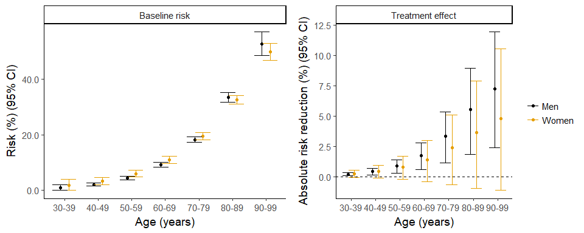

Final results, abstract
================

Results section
===============

Meta-analysis
-------------

### Sex-treatment interaction

On comparing the three models of sex-treatment interactions across all 9 trials of P2Y12 inhibitors (Figure 2), the model assuming a shared sex-treatment interaction for the whole drug-class had both a lower deviance and DIC than the other models (the deviance was 273, 261 and 259 and the DIC was 291, 289 and 286 for the identical, stratified and shared models respectively), indicating better fit. Consequently this model was preferred.

For this shared-effects model the rate ratio (RR) for the sex-treatment interaction was 1.08 (95% Credible Interval (CI) 0.98 to 1.19, Figure 3), indicating approximately 10% lower efficacy in women. Similar estimates for the sex-treatment interactions were found for the identical-effects (RR 1.09; 95% CI 1.01 to 1.17) and independent-effects (RR for prasugrel/ticagrelor versus clopidogrel comparison 1.11; 95% CI 0.93 to 1.32) models.

The treatment effect RR in men for the 3 trials comparing prasugrel or ticagrelor to clopidogrel in ACS was 0.80 (95% CI 0.69 to 0.93). Combining this estimate with the sex-treatment interaction estimate from the shared model yielded a RR in women of 0.86 (95% CI 0.72 to 1.04).

For bleeding, the sex-treatment interaction RR was 1.04 (95% CI 0.88 to 1.21). This estimate did not change importantly from the moderately informative prior we used in the modelling for this outcome (prior for sex-treatment interaction on rate ratio scale 1.00; 95% CI 0.80 to 1.25). In men the treatment effect on bleeding was RR 1.13 (95% CI 0.75 to 1.98). As such, the modelled treatment effect on bleeding in women was RR 1.18 (95% CI 0.76 to 2.08).

### Sex-specific absolute treatment effects in the Scottish Population

17,842 women and 27,818 men were admitted to hospital with myocardial infarction. Mortality was higher for women than men for all-cause mortality (5708 (32.0%) versus 5891 (21.2%)) and cardiovascular mortality (4032 (22.6%) versus 4117 (14.8%)). Mortality related to bleeding was also commoner in women(193 (1.1%) versus 228 (0.8%)) deaths. The sex differences in cardiovascular mortality differed by age with younger women having higher mortality than men, and older women having lower mortality than men (Table 2, Figure 4).

Based on our model the absolute risk reduction in all-cause mortality at one-year was similar in both sexes. For the 27,818 men admitted to hospital with myocardial infarction the modelled absolute risk reduction (ARR) was 2.72% (95% CI 0.92 to 4.35) for cardiovascular, -0.18% (95% CI -0.71 to 0.24) for bleeding and 2.47% (95% CI 0.62 to 4.10) for all-cause mortality. For the 17,842 women the ARRs were similar, 2.70% (95% CI -0.63 to 5.74) for cardiovascular, -0.27% (95% CI -1.06 to 0.30) for bleeding and 2.30% (95% CI -0.92 to 5.22) for all-cause mortality. In contrast with the 0.93 probability that relative treatment efficacy is lower in women than men, the probability that the absolute risk reduction for all-cause mortality was lower in women than men was only 0.53.

In a subsequent analysis, we modelled the absolute treatment effect assuming that the relative treatment effect was the same in both sexes. Under this alternative model a larger benefit was seen in women (3.23%; 95% CI 0.84 to 5.41) than in men (2.21%; 95% CI 0.56 to 3.72).

### Age and sex-specific absolute treatment effects

The same pattern was evident when the absolute treatment effects were modelled within each age-group (Figure 4). Assuming no age-treatment interaction, much larger absolute risk reductions were seen in older people than in younger people. For example the absolute risk reduction was 0.20% (95% CI0.07 to 0.32) and 3.32% (95% CI1.12 to 5.32) in men aged 30-39 and 70-79 respectively.

### Sensitivity analyses

We modelled the absolute treatment effect for a range of different event rates for bleeding deaths in women and men. We allowed for bleeding rates up to 10-fold higher in men than observed, and up to 2-fold higher in women than in men. In all of these analyses, the point estimate for the overall absolute treatment effect in women remained consistently around 2% (range 1.92% to 2.16%).

Abstract
========

Objective
---------

To estimate the absolute treatment effects of newer P2Y12 inhibitors (ticagrelor and prasugrel) compared to clopidogrel in men and women with acute coronary syndrome (ACS).

Methods
-------

We searched Ovid MEDLINE, EMBASE and the Cochrane Central Register of Controlled Trials (CENTRAL) for randomised controlled trials of oral P2Y12 inhibitors for acute stroke or ACS. Age and sex-specific mortality was obtained for all patients admitted to hospital with myocardial infarction in Scotland from 2006 to 2010 (prior to introduction of prasugrel or ticagrelor).

Results
-------

From 9,277 articles, 9 fulfilled our inclusion criteria. Three trials compared newer P2Y12 inhibitors to clopidogrel in ACS, in which the treatment rate ratio (RR) for major adverse cardiovascular events in men was 0.80 (95% CI 0.69 to 0.93). For the same outcome, across all 9 trials the sex-treatment interaction RR was 1.08 (95% CI 0.98 to 1.19). Combining these estimates yielded a treatment RR in women of 0.86 (95% CI 0.72 to 1.04).

17,842 women and 27,818 men were admitted to hospital with myocardial infarction. Mortality was higher for women than men for all-cause (5708 (32.0%) versus 5891 (21.2%)), cardiovascular (4032 (22.6%) versus 4117 (14.8%)) and bleeding (193 (1.1%) versus 228 (0.8%)) deaths.

On applying the sex-specific RRs to this population, the absolute risk reduction for mortality at 1-year was similar for women and men for all-cause (2.30% (95% CI -0.92 to 5.22) versus 2.47% (95% CI 0.62 to 4.10)), cardiovascular (2.70% (95% CI -0.63 to 5.74)) versus 2.72% (95% CI 0.92 to 4.35)) and bleeding (-0.27% (95% CI -1.06 to 0.30) versus -0.18% (95% CI -0.71 to 0.24)) deaths.

Conclusion
----------

Newer P2Y12 inhibitors may be slightly less efficacious in women than men, but the absolute risk reduction is similar in both sexes.

Tables and Figures
==================

### Figure 2 and 3

See Script 8b. Had to edit in inkscape to add tables.

Figure 4 Age and sex specific baseline risks and absolute risk reduction
------------------------------------------------------------------------

    ## png 
    ##   2

