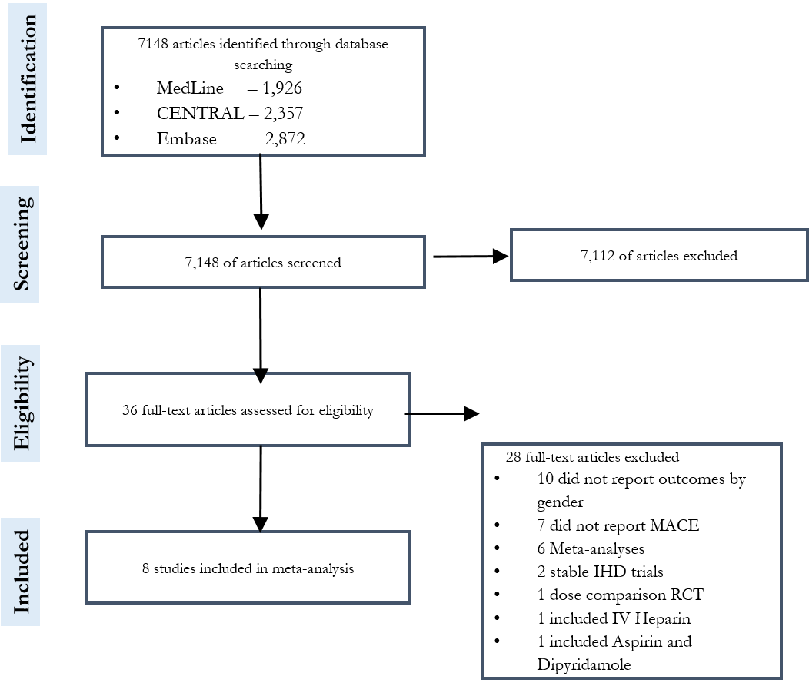

```{r, setup, include=FALSE}
knitr::opts_chunk$set(echo = FALSE, warning = FALSE, message = FALSE)
knitr::opts_knit$set(root.dir = rprojroot::find_rstudio_root_file())

library(coda)
library(tidyverse)

```

# Search strategy
KEN PLEASE

# Consort diagram



# World Health Organisation ICD-10 codes used to identify bleeding deaths
Deaths from bleeding were defined if these codes appeared in any position.

K22.6, K62.5, K92.0, K92.1, K92.2, N83.7, N93.8, N93.9, O03.1,
O03.6, O04.1, O04.6, O05.1, O05.6, O06.1, O07.1, O07.6, O08.1,
O20.8, O20.9, O46, O71.7, O90.2, R04.2, T81.0, K25.0, K25.4,
K26.0, K26.4, K27.0, K27.4, K28.0, K28.4, K29.0, O67, O72.0,
O72.1, O72.2, P26.1, R04.1, R04.8, R04.9, I85.0, K25.2, K25.6,
K26.2, K27.2, K27.6, K28.2, K28.6, H35.6, H43.1, H45.0, I60, I62,
169.0, 169.2, S06.4, S06.5, S06.6, I23.0, I31.2.

# Trial participant baseline characteristics
```{r}
trial_bline <- readr::read_csv("data/trial_bline_characteristics_table.csv")
# trial_bline[] <- map(trial_bline, function (x) ifelse(is.na(x), "", x))
names(trial_bline)[1] <- ""
options(knitr.kable.NA = '')
knitr::kable(trial_bline)
```


# Sex-treatment interaction rate ratio and model information criteria for different models

Results for each model with model information criteria.
```{r, "Model results and diagnostics"}
load("model_summaries/jags_samples_main.Rdata")
load(file = "data/mace_dic.Rdata")

inter_q <- as.data.frame(t(format(round(inter_q,2), nsmall = 2)))
inter_q <- inter_q [c("fixed", "re", "re_tx"),]
inter_q$interaction <- paste0( inter_q[,1], " (", inter_q[,2], "-", inter_q[,3], ")")
mace_dic <- mace_dic[c("fixed_effects", "random_effects", "random_tx_strat"),]
inter_dic <- cbind(`Interaction rate ratio`= inter_q[ , "interaction"], mace_dic)
row.names(inter_dic) <- c("Identical", "Shared", "Shared, stratified by comparison")
knitr::kable(inter_dic)
```

# Estimated sex-treatment interaction for each comparison obtained from the stratified model.

```{r}
# clopidogrel_placebo_ACS clopidogrel_placebo_Stroke  prasugrel_clopidogrel_ACS 
load(file = "jags_samples_main/random_tx_strat.Rdata")
LINE.out <- LINE.out[ , varnames(LINE.out) %in% c("wd_delta[1]", "wd_delta[2]", "wd_delta[3]")]
smry <- summary(LINE.out)
est <- smry$statistics[, "Mean"]
lci_uci <- smry$quantiles[, c("2.5%", "97.5%")]
res <- cbind(est, lci_uci)
rownames(res) <- c("Clopidogrel versus placebo, ACS", "Clopidogrel versus placebo, stroke", 
                   "Prasugrel/Ticagrelor versus placebo, ACS")
colnames(res) <- c("Estimate", "Lower CI", "Upper CI")
res <- round(exp(res), 2)
knitr::kable(res)
```

ACS - acute coronary syndrome, CI - 95% credible interval


```{r}
library(ggplot2)
load("data/Bline, ARR plots.Rdata")
```

# Absolute risk reduction by cause for all analyses
The following series of plots show estimated absolute risk reduction at one-year for death from cardiovascular, bleeding and competing (non-cardiovascular, non-bleeding) causes, as well as all-cause mortality.
Each small multiple represents the results from a model with different treatment effects from the main analysis and each of the sensitivity analyses.
The left-hand column shows the results from the sex-treatment interaction for MACE estimated from the data. The right-hand column shows the results from an assumed null interaction.
The rows show the estimated treatment effect for a range of different sex-treatment interactions for bleeding. 

```{r}
arr_plot + scale_y_continuous("Absolute risk reduction, cardiovascular death (%) (95% CI)") +
  scale_x_discrete ("Age (years)")
bleed_plot +
  scale_x_discrete ("Age (years)")
compete_plot +
  scale_x_discrete ("Age (years)")
total_plot +
  scale_x_discrete ("Age (years)")
```

# Re-analysis of data from recently published paper by Lau et al.

We re-analysed data provided in the Lau et al paper, as well as a combination of data obtained in our systematic review as well as the Lau et al paper using the "shared" model as described in the main manuscript.

```{r}
source("scripts/01_read_data.R")
load("model_summaries/jags_samples_main.Rdata")
inter_q <- as.data.frame(t(format(round(inter_q,2), nsmall = 2)))
inter_q$interaction <- paste0( inter_q[,1], " (", inter_q[,2], "-", inter_q[,3], ")")
inter_q <- inter_q[c("re", "lau", "lau_sa"), "interaction", drop = FALSE]
row.names(inter_q) <- c("Main analysis", "Lau et al", "Both systematic reviews")
colnames(inter_q) <- "Sex-treatment interaction rate ratio"
inter_q$Trials <- map_int(list(main, lau, lau_sa), nrow)
inter_q <- inter_q[, c("Trials", "Sex-treatment interaction rate ratio")]
knitr::kable(inter_q)
```


