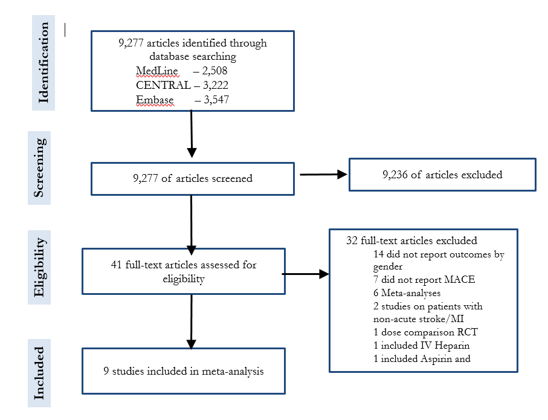

```{r, setup, include=FALSE}
knitr::opts_chunk$set(echo = FALSE, warning = FALSE, message = FALSE)
knitr::opts_knit$set(root.dir = rprojroot::find_rstudio_root_file())

library(coda)
library(tidyverse)
library(readxl)
library(readr)
library(stringr)

```

# Search strategy

## Medline search strategy

(1946 to July 2017)

```{r medline_search}
PanderTable <- function (sheetname= "medline") {
  knitr::kable(readxl::read_excel("Data/search_strategy.xlsx", sheet = sheetname))
}

PanderTable()
```

## Embase search strategy

(1974 to July 2017)

```{r embase_search}
PanderTable("embase")
```

## CENTRAL search

```{r central_search}
PanderTable("central")
```


# Consort diagram



# World Health Organisation ICD-10 codes used to identify bleeding deaths
Deaths from bleeding were defined if these codes appeared in any position.

K22.6, K62.5, K92.0, K92.1, K92.2, N83.7, N93.8, N93.9, O03.1,
O03.6, O04.1, O04.6, O05.1, O05.6, O06.1, O07.1, O07.6, O08.1,
O20.8, O20.9, O46, O71.7, O90.2, R04.2, T81.0, K25.0, K25.4,
K26.0, K26.4, K27.0, K27.4, K28.0, K28.4, K29.0, O67, O72.0,
O72.1, O72.2, P26.1, R04.1, R04.8, R04.9, I85.0, K25.2, K25.6,
K26.2, K27.2, K27.6, K28.2, K28.6, H35.6, H43.1, H45.0, I60, I62,
169.0, 169.2, S06.4, S06.5, S06.6, I23.0, I31.2.

# Trial participant baseline characteristics
```{r bline_characteristics}
trial_bline <- readr::read_csv("data/trial_bline_characteristics_table.csv")
# trial_bline[] <- map(trial_bline, function (x) ifelse(is.na(x), "", x))
names(trial_bline)[1] <- " "
trial_bline <- as.data.frame(trial_bline)
rownames(trial_bline) <- trial_bline[,1]
trial_bline <- trial_bline[,-1]
options(knitr.kable.NA = '')

knitr::kable(trial_bline[,1:4], row.names = TRUE)
knitr::kable(trial_bline[,5:8], row.names = TRUE)

```

Presents percentages for categorical variables and means for continuous variables.

# Trial effect estimates for acute coronary syndrome patients with and without unstable angina

## Relative treatment effect estimates for main treatment effects, stratified by diagnosis, as reported in original trial publications

Trial|Exclude UA|Include UA|Overall
-|---------|----------|-------
CURE|Associated MI – 0.82|No Associated MI – 0.82|0.80 (0.72 to 0.90)
PLATO|NSTEMI – 0.83, STEMI – 0.84|UA – 0.96|0.84 (0.77 to 0.92)
TRITON-TIMI 38|STEMI – 0.81|UA or NSTEMI – 0.81|0.81 (0.73 to 0.90)
TRILOGY ACS|NSTEMI – 0.91|UA – 0.92|0.91 (0.79 to 1.05)

UA - unstable angina, STEMI - ST-elevation MI, NSTEMI - non-ST elevation MI
The effect estimates are risk ratios for CURE and TRITON-TIMI 38, and hazard ratios for PLATO and TRILOGY-ACS.

# Sex-treatment interaction rate ratio

## Rationale for modelling approach

As described in the methods section. We fitted 3 models for the sex-treatment interaction rate ratio; an identical interaction for all trials within the drug-class, shared interactions between trials within the drug-class (using the assumption of exchangeability of covariate-treatment interactions within drug-class), and shared interactions between trials having stratified by indication/treatment.

Rather than simply conduct a stratified model, we opted to include models which allowed information sharing between trials from different drug-classes as a measure to deal with the well-described problem that occurs when estimating covariate-treatment interactions; low sample size and event numbers, which results in poor precision, low power and an increased risk of false positives (Brookes et al, 2004).

We therefore examined for evidence of sex-treatment interaction for P2Y12 inhibitor drugs not at the level of individual drugs, but rather at the level of the drug-class. Indeed, based on the putative mechanisms for a sex-treatment interaction, we would argue that a class-effect is more plausible than an agent-specific effect. For example, as we mention in the discussion, there may be differential thrombogenic tendencies and platelet-subendothelial interactions following antiplatelet therapy in women compared to men. If such a mechanism modifies the effectiveness of P2Y12-inhibitors, it is likely to be an effect common to the drug-class.

Such an effect would also likely be common to acute stroke as well as acute myocardial infarction. These diseases also share similarities in terms of mechanisms of disease (atherothrombotic disease), mechanism of treatment (inhibition of P2Y12-inhibition), outcome of interest (major adverse cardiovascular events), major adverse events (bleeding) and patient populations (acutely ill patients recently admitted to hospital with a major cardiovascular illness), which is why we decided, a priori, to also include stroke trials.

Moreover, for the best-fitting model, on which all subsequent analyses were based, we did not assume that the sex-treatment comparison was the same for all trials, but only that these were exchangeable, ie knowing the sex-treatment interaction for any trial within this drug-class tells us something about the likely size and magnitude of the sex-treatment interaction for each treatment comparison. 

Overall, the effect of this information sharing was conservative, the sex-treatment interaction rate ratio for prasugrel/ticagrelor versus clopidogrel from the stratified model (RR 1.11) was shrunk towards the drug-class average in the shared model (RR 1.08). Importantly, the result was also robust to the choice of model.

### Results for each model with model information criteria.
```{r model_res_diagnostics, "Model results and diagnostics"}
load("model_summaries/jags_samples_main.Rdata")
load(file = "data/mace_dic.Rdata")

inter_q <- as.data.frame(t(format(round(inter_q,2), nsmall = 2)))
inter_q <- inter_q [c("fixed", "re", "re_tx"),]
inter_q$interaction <- paste0( inter_q[,1], " (", inter_q[,2], "-", inter_q[,3], ")")
mace_dic <- mace_dic[c("fixed_effects", "random_effects", "random_tx_strat"),]
inter_dic <- cbind(`Interaction rate ratio`= inter_q[ , "interaction"], mace_dic)
row.names(inter_dic) <- c("Identical", "Shared", "Shared, stratified by comparison")
knitr::kable(inter_dic)
```


In an additional model,  we explored an approach which was intermediate, in terms of information sharing, between the shared and stratified models. In this more complex model trial was nested within treatment comparison (as with the stratified model), but a single shared prior was used across the three treatment comparison estimates. For simplicity, we did not present the results from this intermediate model as the estimate was similar to the more extreme shared and stratified models.

For other examples of Bayesian approaches to analysing trial data which employ similar techniques see; Berry and Berry, 2004 who describe sharing information within physiological systems to detect adverse events, Dixon and Simon, 1991 and Jones et al., 2011 who describe sharing information in sub-group analyses for individual trials and meta-analyses, and Owen, Tincello and Keith, 2015 who demonstrate how information can be shared within drug-classes to improve precision in network meta-analysis.


# Estimated sex-treatment interaction for each comparison obtained from the stratified model.

```{r stratified_model}
# clopidogrel_placebo_ACS clopidogrel_placebo_Stroke  prasugrel_clopidogrel_ACS 
load(file = "jags_samples_main/random_tx_strat.Rdata")
LINE.out <- LINE.out[ , varnames(LINE.out) %in% c("wd_delta[1]", "wd_delta[2]", "wd_delta[3]")]
smry <- summary(LINE.out)
est <- smry$statistics[, "Mean"]
lci_uci <- smry$quantiles[, c("2.5%", "97.5%")]
res <- cbind(est, lci_uci)
rownames(res) <- c("Clopidogrel versus placebo, ACS", "Clopidogrel versus placebo, stroke", 
                   "Prasugrel/Ticagrelor versus placebo, ACS")
colnames(res) <- c("Estimate", "Lower CI", "Upper CI")
res <- round(exp(res), 2)
knitr::kable(res)
```

ACS - acute coronary syndrome, CI - 95% credible interval


```{r arr_plots_load}
library(ggplot2)
load("data/Bline, ARR plots.Rdata")
```

# Absolute risk reduction by cause for all analyses
The following series of plots show estimated absolute risk reduction at one-year for death from cardiovascular, bleeding and competing (non-cardiovascular, non-bleeding) causes, as well as all-cause mortality.
Each small multiple represents the results from a model with different treatment effects from the main analysis and each of the sensitivity analyses.
The left-hand column shows the results from the sex-treatment interaction for MACE estimated from the data. The right-hand column shows the results from an assumed null interaction.
The rows show the estimated treatment effect for a range of different sex-treatment interactions for bleeding. 

## Cardiovascular death 
```{r arr_plots_mace, fig.width=11, fig.height=16}
arr_plot + scale_y_continuous("Absolute risk reduction, cardiovascular death (%) (95% CI)") +
  scale_x_discrete ("Age (years)")
```

## Bleeding deaths
```{r arr_plots_bleed, fig.width=11, fig.height=16}
bleed_plot +
  scale_x_discrete ("Age (years)")
```

## Non-cardiovascular, non-bleeding deaths
```{r arr_plots_compete, fig.width=11, fig.height=16}
compete_plot +
  scale_x_discrete ("Age (years)")
```

## All-cause deaths
```{r arr_plots_total, fig.width=11, fig.height=16}
total_plot +
  scale_x_discrete ("Age (years)")
```

# Re-analysis of data from recently published paper by Lau et al.

We re-analysed data provided in the Lau et al paper, as well as a combination of data obtained in our systematic review as well as the Lau et al paper using the "shared" model as described in the main manuscript.

```{r additional_trials}
source("scripts/01_read_data.R")
load("model_summaries/jags_samples_main.Rdata")
inter_q <- as.data.frame(t(format(round(inter_q,2), nsmall = 2)))
inter_q$interaction <- paste0( inter_q[,1], " (", inter_q[,2], "-", inter_q[,3], ")")
inter_q <- inter_q[c("re", "lau", "lau_sa"), "interaction", drop = FALSE]
row.names(inter_q) <- c("Main analysis", "Lau et al", "Both systematic reviews")
colnames(inter_q) <- "Sex-treatment interaction rate ratio"
inter_q$Trials <- map_int(list(main, lau, lau_sa), nrow)
inter_q <- inter_q[, c("Trials", "Sex-treatment interaction rate ratio")]
knitr::kable(inter_q)
```

# Detailed model description

## Relative treatment effects

The following equations define the shared model. In order to reduce the number of subscripts, and for compatibility with the structure of the data and comparability with the BUGS code, the likelihood and link functions are given separately for men and women allocated to the treatment and control arms. rmc, rwc, rmt and rwt represent the event numbers in men and women in the control groups and men and women in the treatment groups respectively. The number of participants in these groups are represented by nmc, nwc, nmt and nwt respectively. z indexes the trial. Consistent with the BUGS language, the following normal distributions are parameterised in terms of the mean and precision.


### Likelihood and link function

Men controls
$$ rmc_z \sim Bin(pmc_z, nmc_z)  $$
$$ cloglog(pmc_z) = log(time_z) +  \mu_z $$

Women controls
$$ rwc_z \sim Bin(pwc_z, nwc_z)  $$
$$ cloglog(pwc_z) = log(time_z) +  mu_z + wu_z   $$

Men treatment
$$ rmt_z \sim Bin(pmt_z, nmt_z)  $$
$$ cloglog(pmt_z) = log(time_z) +  mu_z +         d_z$$    


Women treatment
$$ rwt_z \sim Bin(pwt_z, nwt_z)  $$
$$ cloglog(pwt_z) = log(time_z) +  mu_z + wu_z + d_z + wd_z $$

### Priors 

Independent priors at the level of each trial were used for the intercept, female-sex and treatment effect in men. A shared prior was used for the sex-treatment interaction.

Intercept (ie baseline for each trial)
$$ mu_z \sim N(0, 0.0001) $$

Effect of female sex
$$ wu_z \sim N(0, 0.0001) $$

Treatment effect in men
$$ d_z  \sim N(0, 0.0001) $$
Shared across trials

Sex-treatment interaction
$$ wd_z \sim N(wd\_delta, wd\_tau)$$

Meta-analysis level priors

Sex-treatment interaction across trials
$$ wd\_delta \sim N(0, 0.0001)$$
Between-trial variation in sex-treatment interaction (precision)
$$ wd\_tau =  1/wd\_var $$
Between-trial variation in sex-treatment interaction (variance)
$$  wd\_var \sim lognormal(-3.23, 1/1.88^2) $$
A weakly informative prior was used for the between-trial variation in sex-treatment interaction ($wd\_var$) as variance parameters are often difficult to fit and this parameter was not the main focus of the analysis. The $lognormal(-3.23, 1/1.88^2)$ prior was chosen from among the set of off-the-shelf priors from Turner et al 2012. Turner et al identified a set of priors for modelling heterogeneity in main treatment effects rather than interactions, and on the log-odds scale rather than the rate ratio scale. Nonetheless, we used this prior as it was felt to be sufficiently wide.

The likelihood and link functions were the same for the "identical" sex-treatment effect model. However, the sex-treatment interaction parameter $wd$ was identical for all trials and so was not indexed and had a single prior ($N(0, 0.001)$).
 
The model stratified by the three treatment comparisons (clopidogrel versus placebo in stroke, clopidogrel versus placebo in ACS and ticagrelor or prasugrel versus clopidogrel in ACS) was also similar to this model. However,an additional index for treatment comparison was added to allow the sex-treatment interaction to vary between comparisons
$wd\_delta_c \sim N(0, 0.0001)$. The between trial variance was assumed to be identical for all treatment comparisons.

### Summarising treatment effects

Using samples from the posterior distributions from these models, treatment effects for men were added to the sex-treatment interaction (both on the log-RR scale) to estimate the sex-specific log-RR for women. The resultant sex-specific log-RRs for women and men were summarised using non-linear least squares in R, assuming a t-distribution.

## Baseline risk model

We modelled cause-specific deaths from bleeding, cardiovascular disease and non-bleeding non-cardiovascular causes using a hierarchical generalized linear regression model with a multinomial likelihood and log link, as these outcomes are mutually exclusive.

In this model the i subscript refers to each row of the data, which is provided below the model. Each j subscript refers to each of the three outcomes.

Likelihood
$y_{i,j}  \sim Multinomial (p_{i,j}, N_i)$ with $\sum p_{i,j}=1$

Linear predictor and link function
$$ log(p_{i,j})= \alpha0_j + \alpha1_j *age_i+ \alpha2_j*gender_i $$


```{r baseline_data}
br <- read.csv("data/baseline_risk_actual_data.csv", as.is = TRUE)
br[, -7]
```

## Application of relative treatment effects to baseline risk model to estimate absolute treatment effects.

Within JAGS we combined the estimates from the baseline model and the relative treatment effect models for the bleeding and cardiovascular outcomes to estimate the absolute risk reduction for cause-specific mortality from bleeding and from cardiovascular death as well as from all-cause mortality. For men and women, this was done through the following model.

$$log(pnew_{i,j} )=\alpha0_j + \alpha1_j*age_i + \alpha2_j*gender_i + men\_logrr_j + women\_logrr_j*gender_i$$
In this model the i subscript refers to each row of the data, as shown above. Also as before the j subscript refers to each of the three outcomes. $men\_logrr_j$ and $women\_logrr_j$ refer to the log-rate ratios for the effect of treatment in men and women respectively. From this model the absolute risk reduction for deaths from bleeding, cardiovascular and non-bleeding non-cardiovascular causes as well as for all causes were derived as follows. 

$$ arr_j =  \frac{1}{\sum n_i} * \sum_{i} (n_i*(p_{i,j} - pnew_{i,j}))  $$

$$ arr = \sum_j arr_j$$

# Model assumptions

The following assumptions were required for this analysis:-

- Sex-treatment interactions are exchangeable between trials within the same drug-class
- Sex-treatment interactions are homogeneous, on the relative scale, across follow-up time
- Sex-specific relative treatment effects are transportable from the clinical trial populations to the target Scottish population
- For the age-specific analysis that non-collapsability does not importantly affect the age-specific rate ratios
- That the rate ratio for non-cardiovascular, non-bleeding events is null.
- That the rate ratios for TIMI bleeding and MACE are the same as the rate ratios for bleeding death and cardiovascular death respectively. This involves the following assumptions:-
	- that bleeding deaths within one year cannot occur without TIMI major bleeding within one-year (with a similar assumption for MACE and cardiovascular deaths). This assumption is actually true by definition as TIMI major bleeding and MACE both include death from bleeding and cardiovascular death respectively as part of their outcome definitions
	- that the proportion of TIMI bleeding events which are bleeding deaths is not altered by treatment (ie that treatment may modify the proportion of patients who experience bleeding within one-year, but not the spectrum of bleeding severity) and that the proportion of MACE events which are cardiovascular deaths are similarly not altered by the treatment (ie that conditional on conditional on having a bleeding (or MACE event), the risk of a bleeding (or cardiovascular) death is not related to treatment)

# Model code


## Identical sex-treatment interaction model

```{r identical_effets_model}
a <- readr::read_lines("jags_code/fixed_effects.txt")
print(noquote(a[-c(1, length(a))]
))
```

## Shared sex-treatment interaction model

```{r shared_effects_model}
a <- readr::read_lines("jags_code/random_effects.txt")
a <- a[-c(1, length(a))]
print(noquote(a))
```

## Shared sex-treatment interaction model, stratified by treatment comparison

```{r stratified_effects_model}
a <- readr::read_lines("jags_code/random_tx_strat.txt")
print(noquote(a[-c(1, length(a))]))
```


# References

Berry, S. M. and Berry, D. A. (2004) ‘Accounting for Multiplicities in Assessing Drug Safety: A Three-Level Hierarchical Mixture Model’, Biometrics, 60(2), pp. 418–426. doi: 10.1111/j.0006-341X.2004.00186.x.

Brookes ST, Whitely E, Egger M, et al. Subgroup analyses in randomized trials: risks of subgroup-specific analyses; power and sample size for the interaction test. J Clin Epidemiol 2004;57:229–36. doi:10.1016/j.jclinepi.2003.08.009

Dixon, D. O. and Simon, R. (1991) ‘Bayesian Subset Analysis’, Biometrics, 47(3), pp. 871–881. doi: 10.2307/2532645.

Jones HE, Ohlssen DI, Neuenschwander B, et al.Bayesian models for subgroup analysis in clinical trials. Clin Trials 2011;8:129–43. doi:10.1177/1740774510396933

Owen RK, Tincello DG, Keith RA. Network Meta-Analysis: Development of a Three-Level Hierarchical Modeling Approach Incorporating Dose-Related Constraints. Value Health 2015;18:116–26. doi:10.1016/j.jval.2014.10.006.

Turner, Rebecca M, Jonathan Davey, Mike J Clarke, Simon G Thompson, and Julian PT Higgins. “Predicting the Extent of Heterogeneity in Meta-Analysis, Using Empirical Data from the Cochrane Database of Systematic Reviews.” International Journal of Epidemiology 41, no. 3 (June 2012): 818–27. doi:10.1093/ije/dys041.
